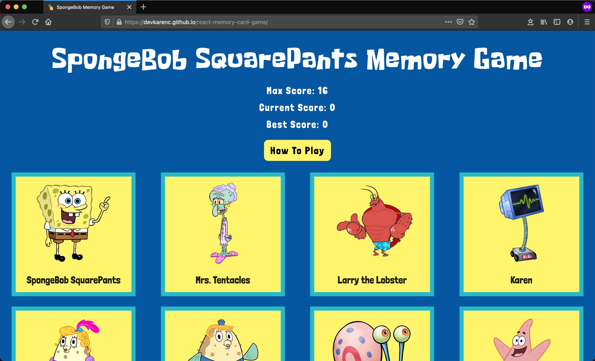
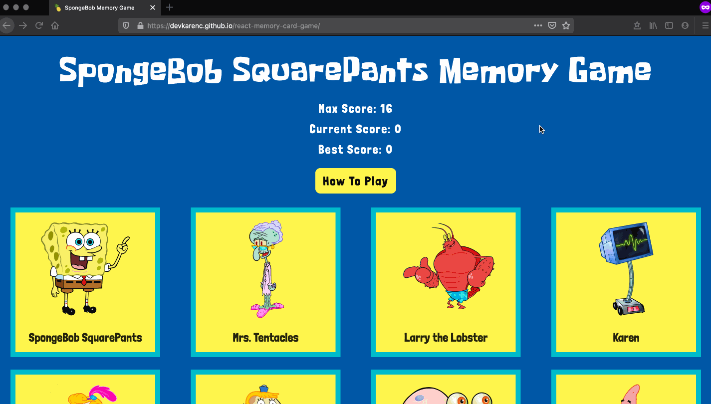

# React Memory Card Game 🍍🧽

This [SpongeBob SquarePants theme Memory Card Game](https://devkarenc.github.io/react-memory-card-game/) is perfect for testing your memory and having fun. It is built with React.js for the front-end framework and Semantic-UI-React for styling modals.

## Learning Outcomes 👩🏻‍💻

- [x] Practice using React Hooks (`useState` and `useEffect`) with functional components
- [x] Review the basics of React.js including the components, states, and the props system
- [x] Break down the application into multiple reusable components
- [x] Utilize a third-party framework (Semantic UI for React)

## Game Screenshot

## Demo Game Play

---

All images copyright owned by Viacom.
